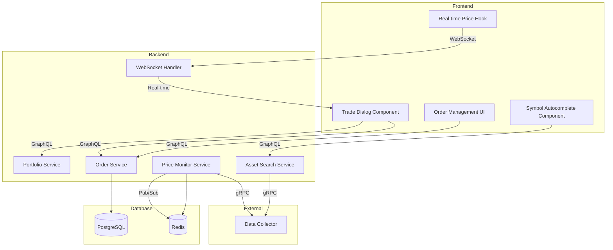
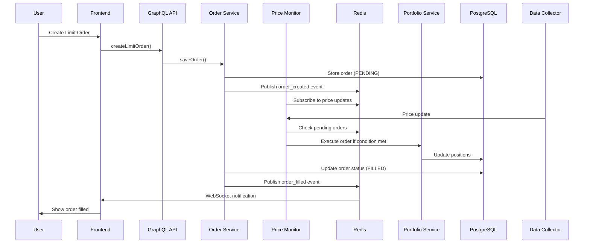

# Trading System Enhancement Plan

## Overview

This plan outlines the implementation of advanced trading features for the Capital Fourge platform, including limit orders, improved asset selection, automatic price fetching, and dual trading modes (quantity-based and USD-based).

## Current State Analysis

### Existing Implementation

- **Frontend**: [`trade-dialog.tsx`](../frontend/components/trading/trade-dialog.tsx) - Basic buy/sell dialog with market orders
- **Backend**: [`PortfolioService.java`](../portfolio-manager/src/main/java/com/Capital Fourge/portfoliomanager/application/services/PortfolioService.java) - Handles buy/sell operations
- **GraphQL Schema**: [`schema.graphqls`](../portfolio-manager/src/main/resources/graphql/schema.graphqls) - Defines mutations for buyAsset/sellAsset
- **Domain Models**: [`Transaction.java`](../portfolio-manager/src/main/java/com/Capital Fourge/portfoliomanager/domain/Transaction.java), [`Position.java`](../portfolio-manager/src/main/java/com/Capital Fourge/portfoliomanager/domain/Position.java)

### Current Issues Identified

1. **Bug in trade-dialog.tsx (line 63-67)**: `useState` is used incorrectly instead of `useEffect` for updating price when market price is fetched
2. **Sell asset selection**: Partially implemented (lines 169-179) but needs refinement
3. **No limit order support**: Only market orders are available
4. **No USD-based trading**: Only quantity-based trading is supported

---

## Feature Requirements

### 1. Limit Orders (Órdenes Límite)

**Description**: Allow users to place buy/sell orders that execute automatically when the price reaches a specified target.

**User Story**: As a trader, I want to set limit orders so that my trades execute automatically at my desired price without me having to monitor the market constantly.

**Acceptance Criteria**:

- Users can set a target price for buy/sell orders
- Orders are stored in the system with status (PENDING, FILLED, CANCELLED, EXPIRED)
- System monitors price changes and executes orders when conditions are met
- Users can view and cancel pending limit orders
- Orders expire after a configurable time period (default: 30 days)

### 2. Improved Sell Asset Selection

**Description**: When selling, display a dropdown with assets from the portfolio's positions instead of a text input.

**User Story**: As a trader, I want to select from my existing assets when selling to avoid typing errors and ensure I'm selling assets I actually own.

**Acceptance Criteria**:

- Dropdown shows all assets in the selected portfolio
- Each option displays: Symbol, Quantity, Current Value
- Dropdown is disabled if portfolio has no positions
- Shows "No assets available" message when appropriate

### 3. Auto-fill Last Price

**Description**: Automatically populate the price field with the current market price when buying or selling.

**User Story**: As a trader, I want the price field to automatically show the current market price so I don't have to manually enter it for market orders.

**Acceptance Criteria**:

- Price field auto-fills with current market price when symbol is entered
- Price updates in real-time when market price changes
- Price field is read-only when in "Market" mode
- Price field is editable when in "Limit" mode

### 4. Dual Trading Modes

**Description**: Support two trading modes:

- **Quantity Mode**: Buy/sell X units of an asset
- **USD Mode**: Buy/sell $X worth of an asset

**User Story**: As a trader, I want to trade by USD amount when I want to invest a specific dollar amount, and by quantity when I want to buy/sell a specific number of shares.

**Acceptance Criteria**:

- Toggle between "Quantity" and "USD" modes
- In Quantity mode: Input number of units, calculate USD value
- In USD mode: Input dollar amount, calculate quantity
- Real-time calculation of the opposite value
- Validation: Cannot sell more than owned (quantity) or more than position value (USD)

### 5. Asset Symbol Autocomplete

**Description**: Provide autocomplete suggestions when typing asset symbols, showing the 5 most similar symbols.

**User Story**: As a trader, I want autocomplete suggestions when searching for assets so I don't have to remember exact symbol names.

**Acceptance Criteria**:

- Show dropdown with 5 most similar symbols as user types
- Support fuzzy matching (e.g., "bit" matches "BITCOIN", "BITO", etc.)
- Display symbol name and description if available
- Debounce input to avoid excessive API calls
- Show loading state while fetching suggestions
- Allow keyboard navigation (arrow keys, enter)

---

## Architecture Design

### System Architecture



### Data Flow for Limit Orders



---

## Implementation Plan

### Phase 1: Backend - Limit Order System

#### 1.1 Domain Models

**Create new domain model: `Order.java`**

```java
package com.Capital Fourge.portfoliomanager.domain;

import java.math.BigDecimal;
import java.time.LocalDateTime;
import java.util.UUID;
import lombok.*;

@Data
@Builder
@NoArgsConstructor
@AllArgsConstructor
public class Order {
    private UUID id;
    private UUID portfolioId;
    private UUID userId;
    private OrderType type; // BUY_LIMIT, SELL_LIMIT
    private String symbol;
    private BigDecimal targetPrice;
    private BigDecimal quantity;
    private BigDecimal usdAmount; // For USD-based orders
    private OrderStatus status; // PENDING, FILLED, CANCELLED, EXPIRED
    private LocalDateTime createdAt;
    private LocalDateTime filledAt;
    private LocalDateTime expiresAt;
    private BigDecimal filledPrice;
    private BigDecimal filledQuantity;
    private String rejectionReason;
}
```

**Create enums:**

```java
// OrderType.java
public enum OrderType {
    BUY_LIMIT,
    SELL_LIMIT
}

// OrderStatus.java
public enum OrderStatus {
    PENDING,
    FILLED,
    CANCELLED,
    EXPIRED,
    REJECTED
}
```

#### 1.2 Repository Layer

**Create: `OrderRepository.java`**

```java
package com.Capital Fourge.portfoliomanager.application.ports.out;

import java.util.List;
import java.util.Optional;
import java.util.UUID;
import com.Capital Fourge.portfoliomanager.domain.Order;
import com.Capital Fourge.portfoliomanager.domain.OrderStatus;

public interface OrderRepository {
    Order save(Order order);
    Optional<Order> findById(UUID id);
    List<Order> findByPortfolioId(UUID portfolioId);
    List<Order> findByUserId(UUID userId);
    List<Order> findByStatus(OrderStatus status);
    List<Order> findPendingOrdersBySymbol(String symbol);
    void deleteById(UUID id);
}
```

#### 1.3 Service Layer

**Create: `OrderService.java`**

```java
package com.Capital Fourge.portfoliomanager.application.services;

@Service
@RequiredArgsConstructor
public class OrderService {
    private final OrderRepository orderRepository;
    private final PortfolioUseCase portfolioUseCase;
    private final MetricRepository metricRepository;

    public Order createLimitOrder(Order order) {
        // Validate order
        // Set expiration (default 30 days)
        // Save order
        // Publish to Redis for price monitoring
        return orderRepository.save(order);
    }

    public Order cancelOrder(UUID orderId) {
        // Update status to CANCELLED
        // Publish cancellation event
        return orderRepository.save(order);
    }

    public List<Order> getUserOrders(UUID userId) {
        return orderRepository.findByUserId(userId);
    }

    public List<Order> getPortfolioOrders(UUID portfolioId) {
        return orderRepository.findByPortfolioId(portfolioId);
    }

    public void executeOrder(UUID orderId, BigDecimal currentPrice) {
        // Check if order conditions are met
        // Execute trade via PortfolioService
        // Update order status to FILLED
        // Publish order filled event
    }
}
```

**Create: `PriceMonitorService.java`**

```java
package com.Capital Fourge.portfoliomanager.application.services;

@Service
@RequiredArgsConstructor
public class PriceMonitorService {
    private final OrderRepository orderRepository;
    private final OrderService orderService;
    private final RedisTemplate<String, String> redisTemplate;

    @RedisListener(channel = "price_updates")
    public void onPriceUpdate(String message) {
        // Parse price update
        // Get pending orders for symbol
        // Check if any orders should be filled
        // Execute orders that meet conditions
    }

    private void checkAndExecuteOrders(String symbol, BigDecimal price) {
        List<Order> pendingOrders = orderRepository.findPendingOrdersBySymbol(symbol);
        for (Order order : pendingOrders) {
            if (shouldExecute(order, price)) {
                orderService.executeOrder(order.getId(), price);
            }
        }
    }

    private boolean shouldExecute(Order order, BigDecimal currentPrice) {
        // Check if order is expired
        // Check if price condition is met
        // For BUY_LIMIT: currentPrice <= targetPrice
        // For SELL_LIMIT: currentPrice >= targetPrice
        return true;
    }
}
```

#### 1.4 GraphQL Schema Updates

**Update: `schema.graphqls`**

```graphql
enum OrderType {
  BUY_LIMIT
  SELL_LIMIT
}

enum OrderStatus {
  PENDING
  FILLED
  CANCELLED
  EXPIRED
  REJECTED
}

type Order {
  id: ID!
  portfolioId: ID!
  userId: ID!
  type: OrderType!
  symbol: String!
  targetPrice: Float!
  quantity: Float
  usdAmount: Float
  status: OrderStatus!
  createdAt: String!
  filledAt: String
  expiresAt: String!
  filledPrice: Float
  filledQuantity: Float
  rejectionReason: String
}

extend type Query {
  orders: [Order]
  ordersByPortfolio(portfolioId: ID!): [Order]
  order(id: ID!): Order
}

extend type Mutation {
  createLimitOrder(
    portfolioId: ID!
    type: OrderType!
    symbol: String!
    targetPrice: Float!
    quantity: Float
    usdAmount: Float
    expiresAt: String
  ): Order
  cancelOrder(orderId: ID!): Order
}
```

#### 1.5 GraphQL Controller

**Create: `OrderGraphQLController.java`**

```java
package com.Capital Fourge.portfoliomanager.infrastructure.adapters.in.graphql;

@Controller
@RequiredArgsConstructor
public class OrderGraphQLController {
    private final OrderService orderService;

    @QueryMapping
    public List<Order> orders(@AuthenticationPrincipal User user) {
        return orderService.getUserOrders(user.getId());
    }

    @QueryMapping
    public List<Order> ordersByPortfolio(@Argument UUID portfolioId) {
        return orderService.getPortfolioOrders(portfolioId);
    }

    @MutationMapping
    public Order createLimitOrder(@Argument CreateOrderInput input) {
        Order order = Order.builder()
            .portfolioId(input.getPortfolioId())
            .type(input.getType())
            .symbol(input.getSymbol())
            .targetPrice(input.getTargetPrice())
            .quantity(input.getQuantity())
            .usdAmount(input.getUsdAmount())
            .status(OrderStatus.PENDING)
            .createdAt(LocalDateTime.now())
            .expiresAt(input.getExpiresAt() != null ?
                input.getExpiresAt() :
                LocalDateTime.now().plusDays(30))
            .build();
        return orderService.createLimitOrder(order);
    }

    @MutationMapping
    public Order cancelOrder(@Argument UUID orderId) {
        return orderService.cancelOrder(orderId);
    }
}
```

#### 1.6 Database Migration

**Create SQL migration:**

```sql
CREATE TABLE orders (
    id UUID PRIMARY KEY,
    portfolio_id UUID NOT NULL,
    user_id UUID NOT NULL,
    type VARCHAR(20) NOT NULL,
    symbol VARCHAR(20) NOT NULL,
    target_price DECIMAL(20, 8) NOT NULL,
    quantity DECIMAL(20, 8),
    usd_amount DECIMAL(20, 8),
    status VARCHAR(20) NOT NULL,
    created_at TIMESTAMP NOT NULL,
    filled_at TIMESTAMP,
    expires_at TIMESTAMP NOT NULL,
    filled_price DECIMAL(20, 8),
    filled_quantity DECIMAL(20, 8),
    rejection_reason VARCHAR(500),
    FOREIGN KEY (portfolio_id) REFERENCES portfolios(id) ON DELETE CASCADE,
    FOREIGN KEY (user_id) REFERENCES users(id) ON DELETE CASCADE
);

CREATE INDEX idx_orders_portfolio ON orders(portfolio_id);
CREATE INDEX idx_orders_user ON orders(user_id);
CREATE INDEX idx_orders_status ON orders(status);
CREATE INDEX idx_orders_symbol ON orders(symbol);
CREATE INDEX idx_orders_expires ON orders(expires_at);
```

---

### Phase 2: Backend - Enhanced Trading

#### 2.1 Update PortfolioService

**Add USD-based trading methods:**

```java
public Portfolio buyAssetByUSD(UUID portfolioId, String symbol, BigDecimal usdAmount, BigDecimal price) {
    BigDecimal quantity = usdAmount.divide(price, 8, RoundingMode.DOWN);
    return buyAsset(portfolioId, symbol, quantity, price);
}

public Portfolio sellAssetByUSD(UUID portfolioId, String symbol, BigDecimal usdAmount, BigDecimal price) {
    BigDecimal quantity = usdAmount.divide(price, 8, RoundingMode.UP);
    return sellAsset(portfolioId, symbol, quantity, price);
}
```

#### 2.2 GraphQL Schema Updates

**Update mutations:**

```graphql
extend type Mutation {
  buyAssetByUSD(
    portfolioId: ID!
    symbol: String!
    usdAmount: Float!
    price: Float!
  ): Portfolio
  sellAssetByUSD(
    portfolioId: ID!
    symbol: String!
    usdAmount: Float!
    price: Float!
  ): Portfolio
}
```

---

### Phase 3: Backend - Enhanced Trading

#### 3.1 Fix Auto-fill Price Bug

**Issue**: Line 63-67 in [`trade-dialog.tsx`](../frontend/components/trading/trade-dialog.tsx) uses `useState` incorrectly.

**Fix**: Replace with `useEffect`:

```typescript
useEffect(() => {
  if (priceType === "market" && priceData?.stockPrice) {
    setPrice(priceData.stockPrice.price.toString());
  }
}, [priceData, priceType]);
```

#### 3.2 Add Trading Mode Toggle

**Add state for trading mode:**

```typescript
const [tradingMode, setTradingMode] = useState<"quantity" | "usd">("quantity");
```

**Add toggle UI:**

```tsx
<div className="flex gap-2 p-1 bg-white/5 rounded-lg mb-4">
  <button
    onClick={() => setTradingMode("quantity")}
    className={`flex-1 py-2 rounded-md transition-all text-sm font-bold ${tradingMode === "quantity" ? "bg-white text-black" : "text-slate-400 hover:text-white"}`}
  >
    POR CANTIDAD
  </button>
  <button
    onClick={() => setTradingMode("usd")}
    className={`flex-1 py-1 rounded-md transition-all text-sm font-bold ${tradingMode === "usd" ? "bg-white text-black" : "text-slate-400 hover:text-white"}`}
  >
    POR USD
  </button>
</div>
```

#### 3.3 Add Real-time Calculation

**Add calculation logic:**

```typescript
const calculatedQuantity = useMemo(() => {
  if (tradingMode === "usd" && price && usdAmount) {
    return (parseFloat(usdAmount) / parseFloat(price)).toFixed(8);
  }
  return quantity;
}, [tradingMode, price, usdAmount, quantity]);

const calculatedUSD = useMemo(() => {
  if (tradingMode === "quantity" && price && quantity) {
    return (parseFloat(quantity) * parseFloat(price)).toFixed(2);
  }
  return usdAmount;
}, [tradingMode, price, quantity, usdAmount]);
```

#### 3.4 Update Input Fields

**Conditional rendering based on trading mode:**

```tsx
{
  tradingMode === "quantity" ? (
    <div className="space-y-2">
      <label className="text-xs uppercase tracking-widest text-slate-500">
        Cantidad
      </label>
      <Input
        type="number"
        placeholder="0.00"
        value={quantity}
        onChange={(e) => setQuantity(e.target.value)}
        className="bg-black/40 border-white/10 text-white"
      />
      {price && quantity && (
        <p className="text-[10px] text-slate-500">
          Valor total: ${calculatedUSD}
        </p>
      )}
    </div>
  ) : (
    <div className="space-y-2">
      <label className="text-xs uppercase tracking-widest text-slate-500">
        Monto USD
      </label>
      <Input
        type="number"
        placeholder="0.00"
        value={usdAmount}
        onChange={(e) => setUsdAmount(e.target.value)}
        className="bg-black/40 border-white/10 text-white"
      />
      {price && usdAmount && (
        <p className="text-[10px] text-slate-500">
          Cantidad estimada: {calculatedQuantity}
        </p>
      )}
    </div>
  );
}
```

#### 3.5 Update Mutations

**Add USD-based mutations:**

```typescript
const BUY_ASSET_BY_USD_MUTATION = gql`
  mutation BuyAssetByUSD(
    $portfolioId: ID!
    $symbol: String!
    $usdAmount: Float!
    $price: Float!
  ) {
    buyAssetByUSD(
      portfolioId: $portfolioId
      symbol: $symbol
      usdAmount: $usdAmount
      price: $price
    ) {
      id
      balance
    }
  }
`;

const SELL_ASSET_BY_USD_MUTATION = gql`
  mutation SellAssetByUSD(
    $portfolioId: ID!
    $symbol: String!
    $usdAmount: Float!
    $price: Float!
  ) {
    sellAssetByUSD(
      portfolioId: $portfolioId
      symbol: $symbol
      usdAmount: $usdAmount
      price: $price
    ) {
      id
      balance
    }
  }
`;
```

#### 3.6 Update Trade Handler

**Handle both trading modes:**

```typescript
const handleTrade = async () => {
  if (!portfolioId || !symbol || !price) {
    toast.error("Por favor, completa todos los campos.");
    return;
  }

  const variables = {
    portfolioId,
    symbol,
    price: parseFloat(price),
  };

  if (tradingMode === "quantity") {
    if (!quantity) {
      toast.error("Por favor, ingresa la cantidad.");
      return;
    }
    variables.quantity = parseFloat(quantity);
  } else {
    if (!usdAmount) {
      toast.error("Por favor, ingresa el monto USD.");
      return;
    }
    variables.usdAmount = parseFloat(usdAmount);
  }

  if (type === "buy") {
    if (tradingMode === "quantity") {
      await buyAsset({ variables });
    } else {
      await buyAssetByUSD({ variables });
    }
  } else {
    if (tradingMode === "quantity") {
      await sellAsset({ variables });
    } else {
      await sellAssetByUSD({ variables });
    }
  }
};
```

---

### Phase 4: Frontend - Enhanced Trade Dialog

#### 4.1 Create Order Management Component

**Create: `orders-dialog.tsx`**

```typescript
"use client";

import { useState } from "react";
import { Dialog, DialogContent, DialogHeader, DialogTitle } from "@/components/ui/dialog";
import { Button } from "@/components/ui/button";
import { useQuery, useMutation, gql } from "@apollo/client";
import { Badge } from "@/components/ui/badge";
import { toast } from "sonner";

const GET_ORDERS_QUERY = gql`
    query GetOrders($portfolioId: ID!) {
        ordersByPortfolio(portfolioId: $portfolioId) {
            id
            type
            symbol
            targetPrice
            quantity
            usdAmount
            status
            createdAt
            expiresAt
            filledPrice
            filledQuantity
        }
    }
`;

const CANCEL_ORDER_MUTATION = gql`
    mutation CancelOrder($orderId: ID!) {
        cancelOrder(orderId: $orderId) {
            id
            status
        }
    }
`;

interface OrdersDialogProps {
    portfolioId: string;
    open: boolean;
    onOpenChange: (open: boolean) => void;
}

export function OrdersDialog({ portfolioId, open, onOpenChange }: OrdersDialogProps) {
    const { data, refetch } = useQuery(GET_ORDERS_QUERY, {
        variables: { portfolioId },
        skip: !open
    });

    const [cancelOrder] = useMutation(CANCEL_ORDER_MUTATION, {
        onCompleted: () => {
            toast.success("Orden cancelada");
            refetch();
        },
        onError: (err) => toast.error(`Error: ${err.message}`)
    });

    const handleCancel = (orderId: string) => {
        cancelOrder({ variables: { orderId } });
    };

    const getStatusColor = (status: string) => {
        switch (status) {
            case "PENDING": return "bg-yellow-500";
            case "FILLED": return "bg-green-500";
            case "CANCELLED": return "bg-red-500";
            case "EXPIRED": return "bg-gray-500";
            default: return "bg-gray-500";
        }
    };

    return (
        <Dialog open={open} onOpenChange={onOpenChange}>
            <DialogContent className="glass border-none text-white sm:max-w-2xl max-h-[80vh] overflow-y-auto">
                <DialogHeader>
                    <DialogTitle className="text-2xl font-bold tracking-tighter uppercase italic">
                        Órdenes Limitadas
                    </DialogTitle>
                </DialogHeader>

                <div className="space-y-4">
                    {data?.ordersByPortfolio?.length === 0 ? (
                        <p className="text-center text-slate-400 py-8">
                            No hay órdenes activas
                        </p>
                    ) : (
                        data?.ordersByPortfolio?.map((order: any) => (
                            <div key={order.id} className="bg-black/40 border border-white/10 rounded-lg p-4">
                                <div className="flex justify-between items-start mb-2">
                                    <div>
                                        <span className={`text-xs font-bold px-2 py-1 rounded ${order.type === "BUY_LIMIT" ? "bg-green-500/20 text-green-400" : "bg-red-500/20 text-red-400"}`}>
                                            {order.type === "BUY_LIMIT" ? "COMPRA" : "VENTA"}
                                        </span>
                                        <span className="ml-2 font-bold">{order.symbol}</span>
                                    </div>
                                    <Badge className={getStatusColor(order.status)}>
                                        {order.status}
                                    </Badge>
                                </div>

                                <div className="grid grid-cols-2 gap-2 text-sm">
                                    <div>
                                        <span className="text-slate-500">Precio objetivo:</span>
                                        <span className="ml-2">${order.targetPrice?.toLocaleString()}</span>
                                    </div>
                                    <div>
                                        <span className="text-slate-500">Cantidad:</span>
                                        <span className="ml-2">{order.quantity || order.usdAmount}</span>
                                    </div>
                                    <div>
                                        <span className="text-slate-500">Creada:</span>
                                        <span className="ml-2">{new Date(order.createdAt).toLocaleDateString()}</span>
                                    </div>
                                    <div>
                                        <span className="text-slate-500">Expira:</span>
                                        <span className="ml-2">{new Date(order.expiresAt).toLocaleDateString()}</span>
                                    </div>
                                </div>

                                {order.status === "PENDING" && (
                                    <Button
                                        onClick={() => handleCancel(order.id)}
                                        variant="outline"
                                        className="mt-3 w-full border-red-500/50 text-red-400 hover:bg-red-500/10"
                                    >
                                        Cancelar Orden
                                    </Button>
                                )}
                            </div>
                        ))
                    )}
                </div>
            </DialogContent>
        </Dialog>
    );
}
```

#### 4.2 Update Trade Dialog for Limit Orders

**Add limit order option:**

```typescript
const [orderType, setOrderType] = useState<"market" | "limit">("market");
```

**Add order type toggle:**

```tsx
<div className="flex gap-2 p-1 bg-white/5 rounded-lg mb-4">
  <button
    onClick={() => setOrderType("market")}
    className={`flex-1 py-2 rounded-md transition-all text-sm font-bold ${orderType === "market" ? "bg-white text-black" : "text-slate-400 hover:text-white"}`}
  >
    MERCADO
  </button>
  <button
    onClick={() => setOrderType("limit")}
    className={`flex-1 py-1 rounded-md transition-all text-sm font-bold ${orderType === "limit" ? "bg-white text-black" : "text-slate-400 hover:text-white"}`}
  >
    LÍMITE
  </button>
</div>
```

**Add limit order mutation:**

```typescript
const CREATE_LIMIT_ORDER_MUTATION = gql`
  mutation CreateLimitOrder(
    $portfolioId: ID!
    $type: OrderType!
    $symbol: String!
    $targetPrice: Float!
    $quantity: Float
    $usdAmount: Float
  ) {
    createLimitOrder(
      portfolioId: $portfolioId
      type: $type
      symbol: $symbol
      targetPrice: $targetPrice
      quantity: $quantity
      usdAmount: $usdAmount
    ) {
      id
      status
    }
  }
`;
```

**Update trade handler for limit orders:**

```typescript
const handleTrade = async () => {
  if (!portfolioId || !symbol || !price) {
    toast.error("Por favor, completa todos los campos.");
    return;
  }

  const variables = {
    portfolioId,
    symbol,
    targetPrice: parseFloat(price),
    type: type === "buy" ? "BUY_LIMIT" : "SELL_LIMIT",
  };

  if (tradingMode === "quantity") {
    if (!quantity) {
      toast.error("Por favor, ingresa la cantidad.");
      return;
    }
    variables.quantity = parseFloat(quantity);
  } else {
    if (!usdAmount) {
      toast.error("Por favor, ingresa el monto USD.");
      return;
    }
    variables.usdAmount = parseFloat(usdAmount);
  }

  if (orderType === "market") {
    // Execute market order
    if (type === "buy") {
      if (tradingMode === "quantity") {
        await buyAsset({
          variables: { ...variables, price: parseFloat(price) },
        });
      } else {
        await buyAssetByUSD({
          variables: { ...variables, price: parseFloat(price) },
        });
      }
    } else {
      if (tradingMode === "quantity") {
        await sellAsset({
          variables: { ...variables, price: parseFloat(price) },
        });
      } else {
        await sellAssetByUSD({
          variables: { ...variables, price: parseFloat(price) },
        });
      }
    }
  } else {
    // Create limit order
    await createLimitOrder({ variables });
    toast.success("Orden límite creada exitosamente");
    setOpen(false);
  }
};
```

---

### Phase 5: Frontend - Limit Order UI

#### 5.1 Backend - Symbol Search Service

**Create: `AssetSearchService.java`**

```java
package com.Capital Fourge.portfoliomanager.application.services;

import java.util.List;
import java.util.stream.Collectors;
import org.springframework.stereotype.Service;
import lombok.RequiredArgsConstructor;

@Service
@RequiredArgsConstructor
public class AssetSearchService {
    private final GrpcFinancialDataClient grpcClient;

    public List<AssetSuggestion> searchSymbols(String query, int limit) {
        if (query == null || query.trim().length() < 2) {
            return List.of();
        }

        // Get all available symbols from data collector
        List<String> allSymbols = grpcClient.getAllAvailableSymbols();

        // Filter and rank by similarity
        return allSymbols.stream()
            .filter(symbol -> symbol.toLowerCase().contains(query.toLowerCase()))
            .limit(limit)
            .map(symbol -> AssetSuggestion.builder()
                .symbol(symbol)
                .name(getAssetName(symbol))
                .build())
            .collect(Collectors.toList());
    }

    private String getAssetName(String symbol) {
        // Fetch asset name from data collector or cache
        return grpcClient.getAssetName(symbol);
    }
}

@Data
@Builder
@NoArgsConstructor
@AllArgsConstructor
class AssetSuggestion {
    private String symbol;
    private String name;
}
```

#### 5.2 GraphQL Schema Updates

**Add symbol search query:**

```graphql
type AssetSuggestion {
  symbol: String!
  name: String
}

extend type Query {
  searchSymbols(query: String!, limit: Int): [AssetSuggestion]
}
```

#### 5.3 GraphQL Controller

**Add search endpoint:**

```java
@QueryMapping
public List<AssetSuggestion> searchSymbols(@Argument String query, @Argument Integer limit) {
    return assetSearchService.searchSymbols(query, limit != null ? limit : 5);
}
```

#### 5.4 Frontend - Autocomplete Component

**Create: `symbol-autocomplete.tsx`**

```typescript
"use client";

import { useState, useEffect, useRef } from "react";
import { useQuery, gql } from "@apollo/client";
import { Input } from "@/components/ui/input";
import { Search, Loader2 } from "lucide-react";

const SEARCH_SYMBOLS_QUERY = gql`
    query SearchSymbols($query: String!, $limit: Int!) {
        searchSymbols(query: $query, limit: $limit) {
            symbol
            name
        }
    }
`;

interface SymbolAutocompleteProps {
    value: string;
    onChange: (value: string) => void;
    placeholder?: string;
    disabled?: boolean;
}

export function SymbolAutocomplete({
    value,
    onChange,
    placeholder = "Buscar activo...",
    disabled = false
}: SymbolAutocompleteProps) {
    const [query, setQuery] = useState(value);
    const [showSuggestions, setShowSuggestions] = useState(false);
    const [selectedIndex, setSelectedIndex] = useState(-1);
    const containerRef = useRef<HTMLDivElement>(null);
    const inputRef = useRef<HTMLInputElement>(null);

    const { data, loading } = useQuery(SEARCH_SYMBOLS_QUERY, {
        variables: { query, limit: 5 },
        skip: query.length < 2,
        fetchPolicy: "network-only"
    });

    const suggestions = data?.searchSymbols || [];

    // Debounce query updates
    useEffect(() => {
        const timer = setTimeout(() => {
            setQuery(value);
        }, 300);
        return () => clearTimeout(timer);
    }, [value]);

    // Close suggestions when clicking outside
    useEffect(() => {
        const handleClickOutside = (event: MouseEvent) => {
            if (containerRef.current && !containerRef.current.contains(event.target as Node)) {
                setShowSuggestions(false);
            }
        };
        document.addEventListener("mousedown", handleClickOutside);
        return () => document.removeEventListener("mousedown", handleClickOutside);
    }, []);

    const handleInputChange = (e: React.ChangeEvent<HTMLInputElement>) => {
        const newValue = e.target.value.toUpperCase();
        onChange(newValue);
        setShowSuggestions(true);
        setSelectedIndex(-1);
    };

    const handleSelectSuggestion = (symbol: string) => {
        onChange(symbol);
        setShowSuggestions(false);
        inputRef.current?.blur();
    };

    const handleKeyDown = (e: React.KeyboardEvent<HTMLInputElement>) => {
        if (!showSuggestions || suggestions.length === 0) return;

        switch (e.key) {
            case "ArrowDown":
                e.preventDefault();
                setSelectedIndex(prev =>
                    prev < suggestions.length - 1 ? prev + 1 : prev
                );
                break;
            case "ArrowUp":
                e.preventDefault();
                setSelectedIndex(prev => prev > 0 ? prev - 1 : -1);
                break;
            case "Enter":
                e.preventDefault();
                if (selectedIndex >= 0) {
                    handleSelectSuggestion(suggestions[selectedIndex].symbol);
                }
                break;
            case "Escape":
                setShowSuggestions(false);
                break;
        }
    };

    return (
        <div ref={containerRef} className="relative">
            <div className="relative">
                <Search className="absolute left-3 top-1/2 transform -translate-y-1/2 w-4 h-4 text-slate-400" />
                <Input
                    ref={inputRef}
                    type="text"
                    placeholder={placeholder}
                    value={value}
                    onChange={handleInputChange}
                    onFocus={() => setShowSuggestions(true)}
                    onKeyDown={handleKeyDown}
                    disabled={disabled}
                    className="bg-black/40 border-white/10 text-white pl-10"
                />
                {loading && (
                    <Loader2 className="absolute right-3 top-1/2 transform -translate-y-1/2 w-4 h-4 text-slate-400 animate-spin" />
                )}
            </div>

            {showSuggestions && suggestions.length > 0 && (
                <div className="absolute z-50 w-full mt-1 bg-black/95 border border-white/10 rounded-lg shadow-xl overflow-hidden">
                    {suggestions.map((suggestion: any, index: number) => (
                        <button
                            key={suggestion.symbol}
                            onClick={() => handleSelectSuggestion(suggestion.symbol)}
                            className={`w-full px-4 py-3 text-left hover:bg-white/10 transition-colors ${
                                index === selectedIndex ? "bg-white/10" : ""
                            }`}
                        >
                            <div className="flex items-center justify-between">
                                <span className="font-bold text-white">{suggestion.symbol}</span>
                                {suggestion.name && (
                                    <span className="text-sm text-slate-400">{suggestion.name}</span>
                                )}
                            </div>
                        </button>
                    ))}
                </div>
            )}

            {showSuggestions && query.length >= 2 && !loading && suggestions.length === 0 && (
                <div className="absolute z-50 w-full mt-1 bg-black/95 border border-white/10 rounded-lg shadow-xl p-4 text-center text-slate-400">
                    No se encontraron resultados para "{query}"
                </div>
            )}
        </div>
    );
}
```

#### 5.5 Update Trade Dialog

**Replace symbol input with autocomplete:**

```typescript
import { SymbolAutocomplete } from "./symbol-autocomplete";

// In the trade dialog JSX:
<div className="space-y-2">
    <label className="text-xs uppercase tracking-widest text-slate-500">Símbolo (Ticker)</label>
    {type === "sell" && currentPortfolioPositions.length > 0 ? (
        <select
            value={symbol}
            onChange={(e) => handleSymbolChange(e.target.value)}
            className="w-full bg-black/40 border border-white/10 rounded-md p-2 text-sm text-white focus:outline-none focus:ring-1 focus:ring-slate-400"
        >
            <option value="">Seleccionar activo...</option>
            {currentPortfolioPositions.map((pos: any) => (
                <option key={pos.symbol} value={pos.symbol}>{pos.symbol}</option>
            ))}
        </select>
    ) : (
        <SymbolAutocomplete
            value={symbol}
            onChange={handleSymbolChange}
            placeholder="AAPL, BTC, etc"
        />
    )}
</div>
```

---

### Phase 6: Asset Symbol Autocomplete

#### 5.1 Update useRealTimePrice Hook

**Enhance to support limit order monitoring:**

```typescript
import { useEffect, useState } from "react";
import { useSubscription, gql } from "@apollo/client";

const PRICE_UPDATE_SUBSCRIPTION = gql`
  subscription OnPriceUpdate($symbols: [String!]!) {
    priceUpdate(symbols: $symbols) {
      symbol
      price
      timestamp
    }
  }
`;

export function useRealTimePrice(symbols: string[]) {
  const [prices, setPrices] = useState<Record<string, number>>({});

  const { data } = useSubscription(PRICE_UPDATE_SUBSCRIPTION, {
    variables: { symbols },
    skip: symbols.length === 0,
  });

  useEffect(() => {
    if (data?.priceUpdate) {
      setPrices((prev) => ({
        ...prev,
        [data.priceUpdate.symbol]: data.priceUpdate.price,
      }));
    }
  }, [data]);

  return prices;
}
```

#### 5.2 Add WebSocket Support

**Update WebSocket configuration:**

```java
@Configuration
@EnableWebSocketMessageBroker
public class WebSocketConfig implements WebSocketMessageBrokerConfigurer {

    @Override
    public void configureMessageBroker(MessageBrokerRegistry config) {
        config.enableSimpleBroker("/topic", "/queue");
        config.setApplicationDestinationPrefixes("/app");
    }

    @Override
    public void registerStompEndpoints(StompEndpointRegistry registry) {
        registry.addEndpoint("/ws")
                .setAllowedOriginPatterns("*")
                .withSockJS();
    }
}
```

**Add price update publisher:**

```java
@Service
@RequiredArgsConstructor
public class PriceUpdatePublisher {
    private final SimpMessagingTemplate messagingTemplate;

    public void publishPriceUpdate(String symbol, BigDecimal price) {
        PriceUpdate update = PriceUpdate.builder()
            .symbol(symbol)
            .price(price)
            .timestamp(LocalDateTime.now())
            .build();
        messagingTemplate.convertAndSend("/topic/price-updates", update);
    }
}
```

---

### Phase 7: Real-time Price Updates

#### 7.1 Update useRealTimePrice Hook

**Enhance to support limit order monitoring:**

```typescript
import { useEffect, useState } from "react";
import { useSubscription, gql } from "@apollo/client";

const PRICE_UPDATE_SUBSCRIPTION = gql`
  subscription OnPriceUpdate($symbols: [String!]!) {
    priceUpdate(symbols: $symbols) {
      symbol
      price
      timestamp
    }
  }
`;

export function useRealTimePrice(symbols: string[]) {
  const [prices, setPrices] = useState<Record<string, number>>({});

  const { data } = useSubscription(PRICE_UPDATE_SUBSCRIPTION, {
    variables: { symbols },
    skip: symbols.length === 0,
  });

  useEffect(() => {
    if (data?.priceUpdate) {
      setPrices((prev) => ({
        ...prev,
        [data.priceUpdate.symbol]: data.priceUpdate.price,
      }));
    }
  }, [data]);

  return prices;
}
```

#### 7.2 Add WebSocket Support

**Update WebSocket configuration:**

```java
@Configuration
@EnableWebSocketMessageBroker
public class WebSocketConfig implements WebSocketMessageBrokerConfigurer {

    @Override
    public void configureMessageBroker(MessageBrokerRegistry config) {
        config.enableSimpleBroker("/topic", "/queue");
        config.setApplicationDestinationPrefixes("/app");
    }

    @Override
    public void registerStompEndpoints(StompEndpointRegistry registry) {
        registry.addEndpoint("/ws")
                .setAllowedOriginPatterns("*")
                .withSockJS();
    }
}
```

**Add price update publisher:**

```java
@Service
@RequiredArgsConstructor
public class PriceUpdatePublisher {
    private final SimpMessagingTemplate messagingTemplate;

    public void publishPriceUpdate(String symbol, BigDecimal price) {
        PriceUpdate update = PriceUpdate.builder()
            .symbol(symbol)
            .price(price)
            .timestamp(LocalDateTime.now())
            .build();
        messagingTemplate.convertAndSend("/topic/price-updates", update);
    }
}
```

---

## Testing Strategy

### Unit Tests

**Backend Tests:**

- `OrderServiceTest.java` - Test order creation, cancellation, execution
- `PriceMonitorServiceTest.java` - Test price monitoring and order execution
- `PortfolioServiceTest.java` - Test USD-based trading methods

**Frontend Tests:**

- `trade-dialog.test.tsx` - Test trading mode toggle, calculations, form validation
- `orders-dialog.test.tsx` - Test order display, cancellation

### Integration Tests

- Test limit order creation and execution flow
- Test real-time price updates triggering order execution
- Test USD-based trading calculations

### E2E Tests

- Test complete user flow: create limit order → wait for price → order executes
- Test dual trading modes: quantity vs USD
- Test sell asset selection from portfolio positions

---

## Deployment Considerations

### Database Migration

- Run SQL migration to create `orders` table
- Create indexes for performance

### Redis Configuration

- Configure Redis pub/sub for price updates
- Set up Redis for order queue

### WebSocket Configuration

- Enable WebSocket support in production
- Configure CORS for WebSocket connections

### Monitoring

- Add metrics for order execution latency
- Monitor order queue depth
- Alert on failed order executions

---

## Security Considerations

### Input Validation

- Validate all order parameters
- Prevent negative quantities/prices
- Validate order expiration dates

### Authorization

- Ensure users can only access their own orders
- Validate portfolio ownership before creating orders

### Rate Limiting

- Implement rate limiting for order creation
- Prevent order spamming

---

## Performance Optimization

### Database Optimization

- Use indexes on frequently queried fields
- Implement pagination for order lists
- Cache active orders in Redis

### Real-time Updates

- Use WebSocket for efficient price updates
- Batch order checks to reduce database load
- Implement order queue for efficient processing

---

## Future Enhancements

1. **Stop-Loss Orders**: Automatically sell when price drops below threshold
2. **Take-Profit Orders**: Automatically sell when price rises above threshold
3. **Trailing Stop Orders**: Dynamic stop-loss that adjusts with price
4. **Order Slicing**: Break large orders into smaller chunks
5. **Order Templates**: Save frequently used order configurations
6. **Advanced Order Types**: OCO (One-Cancels-Other), IF-THEN orders

---

## Summary

This plan provides a comprehensive roadmap for implementing advanced trading features in the Capital Fourge platform:

1. **Limit Orders**: Full backend and frontend implementation with real-time monitoring
2. **Improved Sell Selection**: Dropdown with portfolio positions
3. **Auto-fill Price**: Fixed bug and enhanced with real-time updates
4. **Dual Trading Modes**: Quantity and USD-based trading with real-time calculations
5. **Asset Symbol Autocomplete**: Smart search with fuzzy matching and keyboard navigation

The implementation follows the existing hexagonal architecture pattern and integrates seamlessly with the current codebase.
